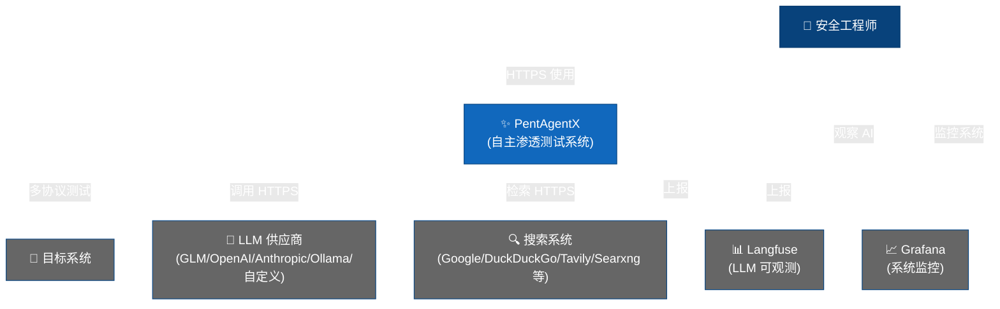

# PentAgentX

<div align="center" style="font-size: 1.5em; margin: 20px 0;">
    <strong>P</strong>enetration testing <strong>A</strong>rtificial <strong>G</strong>eneral <strong>I</strong>ntelligence
</div>
<br>

**PentAgentX** 是一个由 AI 多智能体驱动的自动化渗透测试平台。它通过多智能体协作(designer / planner / supervisor / searcher / pentester / coder / executor),自动完成侦察、漏洞验证、凭证窃取、横向移动到报告输出的完整渗透测试流程,所有工具调用均在 Docker 沙箱中隔离执行。

> 本项目基于开源项目 [PentAGI](https://github.com/vxcontrol/pentagi) 二次开发,感谢上游团队的工作。

---

## 目录

- [功能特性](#功能特性)
- [系统架构](#系统架构)
- [快速开始](#快速开始)
- [LLM 供应商配置](#llm-供应商配置)
- [API 访问](#api-访问)
- [高级集成](#高级集成)
- [开发指南](#开发指南)
- [致谢与许可证](#致谢与许可证)

## 功能特性

- **安全隔离**:所有操作在沙箱化 Docker 容器中执行,与宿主环境完全隔离
- **全自主渗透**:AI 智能体自动分析目标、规划路径并执行渗透测试步骤,支持执行监控与智能任务规划
- **多智能体协作**:designer(任务设计)→ planner(计划生成)→ supervisor(调度)→ searcher / pentester / coder 等专职智能体分工执行
- **专业工具链**:内置 20+ 专业安全工具(nmap、metasploit、sqlmap 等),支持按任务自动选择容器镜像
- **智能记忆**:基于 pgvector 的长期记忆,沉淀历史测试结果与成功攻击路径
- **知识图谱**:集成 [Graphiti](https://github.com/getzep/graphiti) + Neo4j,追踪语义关系与上下文
- **Web 情报**:内置 [scraper](https://hub.docker.com/r/vxcontrol/scraper) 浏览器抓取最新网页信息
- **外部搜索引擎**:支持 Tavily、Traversaal、Perplexity、DuckDuckGo、Google Custom Search、Sploitus、Searxng
- **完善可观测**:Grafana / Prometheus 监控、Langfuse LLM 分析、OpenTelemetry 全链路追踪
- **结构化报告**:生成包含完整攻击路径、关键证据、风险评级与修复建议的渗透测试报告
- **双 API 体系**:REST + GraphQL,支持 Bearer Token 认证,便于自动化集成
- **多 LLM 支持**:OpenAI、Anthropic、Gemini、AWS Bedrock、Ollama、DeepSeek、**GLM(智谱)**、Kimi、Qwen 及自定义 OpenAI 兼容端点
- **持久化存储**:所有命令与输出存入 PostgreSQL(pgvector 扩展),支持会话级回溯
- **一键部署**:Docker Compose 一条命令拉起全部服务

## 系统架构



**核心组件:**

| 组件 | 说明 |
|---|---|
| `backend/` | Go 后端:REST + GraphQL API、多智能体调度、工具执行 |
| `orchestrator/` | Python LangGraph 编排服务:designer / planner / supervisor 决策流 |
| `frontend/` | React + TypeScript Web 控制台(实时订阅推送) |
| `migrations/` | goose 数据库迁移脚本 |
| `scripts/` | 运维与部署脚本(entrypoint、license、版本管理) |

**数据流:** 用户创建 Flow(渗透任务)→ 后端队列派发智能体 → designer 设计任务 → planner 生成待办计划 → supervisor 调度专职智能体在 Docker 沙箱中执行工具 → 过程与结果实时经 GraphQL Subscription 推送到前端 → 结束后输出结构化报告。

## 快速开始

### 环境要求

- Docker 与 Docker Compose
- 至少 2 vCPU / 4GB 内存 / 20GB 磁盘
- 可访问外网(拉取镜像、调用 LLM)

### 部署步骤

```bash
# 1. 克隆仓库
git clone https://github.com/fww111/PentAgentX.git
cd PentAgentX

# 2. 生成环境配置
cp .env.example .env

# 3. 编辑 .env,至少配置一个 LLM 供应商的 API Key
#    例如使用 GLM(智谱):
#    GLM_API_KEY=你的密钥

# 4. 启动全部服务
docker compose up -d

# 5. 访问 https://localhost:8443 (首次登录账号在首次启动时创建)
```

> 启动时可组合可选组件:`docker-compose-observability.yml`(监控)、`docker-compose-langfuse.yml`(LLM 分析)、`docker-compose-graphiti.yml`(知识图谱)。

### 生产环境安全建议

- 建议采用双节点架构,将 worker(渗透工具执行)隔离在独立服务器,避免不可信代码在主系统上运行
- 通过 `SCRAPER_PRIVATE_URL` 配置爬虫服务的访问凭据
- 更改默认的数据库口令与 Cookie 签名盐值(`COOKIE_SIGNING_SALT`)

## LLM 供应商配置

在 `.env` 中至少配置一个供应商的 API Key。常用供应商:

| 供应商 | 环境变量 | 说明 |
|---|---|---|
| **GLM(智谱)** | `GLM_API_KEY` / `GLM_SERVER_URL` | 国内访问友好,支持 glm-5.3-flash / glm-5 等型号 |
| OpenAI | `OPEN_AI_KEY` | GPT 系列 |
| Anthropic | `ANTHROPIC_API_KEY` | Claude 系列 |
| Google AI | `GEMINI_API_KEY` | Gemini 系列 |
| AWS Bedrock | `BEDROCK_ACCESS_KEY_ID` 等 | 企业级模型,支持多种认证方式 |
| DeepSeek | `DEEPSEEK_API_KEY` | 推理能力强 |
| Kimi | `KIMI_API_KEY` | 超长上下文 |
| Qwen | `QWEN_API_KEY` | 阿里云通义系列 |
| Ollama | `OLLAMA_SERVER_URL` | 本地/云端私有模型,零 API 成本 |
| 自定义 | `CUSTOM_LLM_SERVER_URL` | 任意 OpenAI 兼容端点 |

GLM 配置示例(各角色使用的模型可在 `backend/pkg/providers/glm/config.yml` 中按角色调整):

```bash
GLM_API_KEY=你的智谱APIKey
GLM_SERVER_URL=https://open.bigmodel.cn/api/paas/v4
```

## API 访问

1. 在 Web 控制台 **Settings → Tokens** 生成 API Token;
2. 使用 Bearer Token 调用 REST 或 GraphQL 接口:

```bash
curl -H "Authorization: Bearer <你的Token>" \
     -H "Content-Type: application/json" \
     https://localhost:8443/api/v1/info
```

- GraphQL 端点:`POST https://localhost:8443/api/v1/graphql`
- Swagger 文档:`https://localhost:8443/swagger/index.html`
- GraphQL Playground:`https://localhost:8443/graphql/playground`

## 高级集成

| 功能 | 启动方式 |
|---|---|
| 监控告警(Prometheus / VictoriaMetrics / Grafana / Jaeger) | `docker compose -f docker-compose.yml -f docker-compose-observability.yml up -d` |
| LLM 调用分析(Langfuse) | `docker compose -f docker-compose.yml -f docker-compose-langfuse.yml up -d` |
| 知识图谱(Graphiti + Neo4j) | `docker compose -f docker-compose.yml -f docker-compose-graphiti.yml up -d` |
| OAuth 登录(GitHub / Google) | 在 `.env` 中配置 OAuth Client ID / Secret 后重启 |

## 开发指南

### 后端(Go,在 `backend/` 目录)

```bash
go mod download                               # 安装依赖
go build -trimpath -o pentagentx ./cmd/pentagentx  # 构建主程序
go test ./...                                 # 运行全部测试
golangci-lint run --timeout=5m                # 代码检查
```

代码生成(修改 schema 后执行):

```bash
go run github.com/99designs/gqlgen --config ./gqlgen/gqlgen.yml       # GraphQL
swag init -g ../../pkg/server/router.go -o pkg/server/docs/ ...       # Swagger
```

### 前端(React,在 `frontend/` 目录)

```bash
npm ci                    # 安装依赖
npm run dev               # 开发服务器 http://localhost:8000
npm run build             # 生产构建
npm run test              # Vitest 单元测试
npm run graphql:generate  # 根据 .graphql 文件生成类型
```

### 辅助测试工具

- `backend/cmd/ctester/` — 容器执行测试
- `backend/cmd/ftester/` — LLM 函数调用测试
- `backend/cmd/etester/` — 向量嵌入测试
- `backend/cmd/installer/` — 交互式部署向导

## 致谢与许可证

本项目的实现得益于以下研究与开源工作:

- [Emerging Architectures for LLM Applications](https://lilianweng.github.io/posts/2023-06-23-agent)
- [A Survey of Autonomous LLM Agents](https://arxiv.org/abs/2403.08299)
- [Codel](https://github.com/semanser/codel) — 智能体自动化架构的早期灵感来源
- [PentAGI](https://github.com/vxcontrol/pentagi) — 上游开源项目

**PentAgentX** 基于 [MIT License](LICENSE) 开源发布。

第三方依赖的许可证报告见 [licenses/](licenses/) 目录。

---

⚠️ **免责声明**:本项目仅供授权范围内的安全测试与研究使用。请确保在使用前获得目标系统所有者的明确授权,遵守当地法律法规,勿用于任何非法用途。
